# SUN MEDIA — Agency Operating System: arxitektura

Bu hujjat SUN MEDIA tizimining yagona texnik manbasi. Kod bilan birga yangilanadi.

- **Mobil ilova** (`SUN-MEDIA-USER`): Expo / React Native, TypeScript strict. Mijozlar, xodimlar va rahbariyat uchun.
- **Admin panel** (`SUN-MEDIA-ADMIN`): Next.js App Router, Vercel. Boshqaruv, hisobotlar, PDF.
- **Backend** (`SUN-MEDIA-ADMIN/supabase`): Postgres + RLS, Auth, Realtime, Storage, Edge Functions, pg_cron.

## 1. Asosiy qarorlar

| # | Qaror | Sabab |
|---|---|---|
| 1 | Bitta agentlik (single-tenant). `clients` — SUN MEDIA mijoz kompaniyalari. | Talab faqat SUN MEDIA uchun. Multi-agency SaaS kerak bo'lsa, barcha jadvallarga `agency_id` qo'shiladi. |
| 2 | Xavfsizlik chegarasi — **RLS**. Admin panel ham foydalanuvchi sessiyasi bilan ishlaydi. `service_role` faqat Auth admin amallari (user yaratish/bloklash) va Edge Functions uchun ishlatiladi. | UI'da yashirish ruxsat emas; har bir so'rov bazada tekshiriladi. |
| 3 | Rollar va ruxsatlar jadvalda (`roles`, `permissions`, `role_permissions`, `user_permissions`). JWT/`user_metadata` avtorizatsiyada ishlatilmaydi. | Admin ruxsatlarni o'zi o'zgartiradi. O'zgarish darhol kuchga kiradi. |
| 4 | Odam yo **staff**, yo **client user**: ikkalasi bir vaqtda bo'lishi mumkin emas (trigger bilan). | Interfeys va izolyatsiya soddalashadi. |
| 5 | Kontent statusi faqat RPC orqali o'zgaradi (`set_content_status`, `submit_content_version`, `review_content_version`). | Pipeline qoidalari, tarix va bildirishnomalar bitta joyda. |
| 6 | Davomatni **faqat** `attendance.manage` egasi belgilaydi. Xodim o'zini "keldim" deb belgilay olmaydi. | Talab №13. |
| 7 | Realtime — private Broadcast. Kanal orqali faqat **signal** (`table`, `id`, `client_id`) yuboriladi, ilova ma'lumotni RLS orqali qayta oladi. Chat xabarlari to'liq yuboriladi, lekin faqat xona a'zolariga. | Realtime orqali ma'lumot sizib chiqmaydi. |
| 8 | Fayllar: avval `files` yozuvi (RPC), keyin Storage'ga resumable (TUS) yuklash, oxirida `complete_file_upload`. Storage RLS `files` jadvalining RLS'iga tayanadi. | Mijozlar fayllari to'liq izolyatsiya qilinadi. Katta videolar yuklash davomida uzilsa, yuklash o'sha joydan davom etadi. |
| 9 | Tarif limitlari obuna yaratilganda snapshot qilinadi (`subscription_quotas`). Foydalanish ledger'ga yoziladi (`client_plan_usage`: `auto` yoki `manual`). | Tarif keyin o'zgarsa ham mijozning sotib olgani o'zgarmaydi. Tuzatish ham iz qoldiradi. |
| 10 | Soxta ma'lumot yo'q. Analitika faqat `manual` yoki `api` manbadan keladi. Ma'lumot yo'q bo'lsa, hisobotda `NULL` va "kiritilmagan" deb ko'rsatiladi. | Talab №25, №41. |
| 11 | Barcha vaqtlar `timestamptz` turida saqlanadi. "Bugun" `Asia/Tashkent` (`app_settings.agency.timezone`) bo'yicha hisoblanadi. | Kunlik hisoblar (davomat, command center) to'g'ri chiqadi. |
| 12 | Muhim jadvallarda soft delete (`deleted_at`). Audit log faqat trigger va RPC'lar orqali yoziladi, o'zgarmaydi. | Tiklash va nazorat uchun. |

### Belgilangan taxminlar (tasdiqlash kerak)

- **T1.** `client_employee` sukut bo'yicha kontentni tasdiqlay olmaydi. Buning uchun admin rolga `client.approve` ruxsatini qo'shishi kerak.
- **T2.** Director: `roles.manage` va `settings.manage` ruxsatlaridan tashqari hamma narsa. Admin: `finance.read` ruxsatidan tashqari hamma narsa.
- **T3.** Mijozga ko'rinadigan papkalar: APPROVED, LOGOS, BRANDBOOK, MUSIC, PHOTOS, DOCUMENTS, CONTRACTS. RAW va EDITED — faqat ichki.
- **T4.** Ish haftasi dushanba–shanba (`employees.work_days`), ish boshlanishi 09:00, kechikishga 10 daqiqa ruxsat beriladi.
- **T5.** Kontent **published** bo'lganda (dizayn va reklama kreativi **approved** bo'lganda) tarifdan bitta xizmat yechiladi. Har bir yakunlangan syomka bitta "syomka kuni" hisoblanadi.
- **T6.** Ochiq ro'yxatdan o'tishni o'chirish tavsiya etiladi. Rolsiz foydalanuvchi "Hisobingiz faollashtirilmagan" ekranini ko'radi.
- **T7.** Mijoz ilovasi rus va ingliz tillariga tayyor (`profiles.locale`), lekin birinchi til o'zbek (lotin).

## 2. Rollar va ruxsatlar

| Ruxsat | Owner | Director | Admin | PM | SMM | Operator | Editor | Designer | Copywriter |
|---|---|---|---|---|---|---|---|---|---|
| dashboard.view (Command Center) | ✅ | ✅ | ✅ | | | | | | |
| clients.read_all / clients.manage | ✅ | ✅ | ✅ | | | | | | |
| employees.manage, attendance.* | ✅ | ✅ | ✅ | | | | | | |
| roles.manage | ✅ | | ✅ | | | | | | |
| projects.manage, shootings.manage | ✅ | ✅ | ✅ | ✅¹ | | | | | |
| content.manage, tasks.manage, approvals.manage | ✅ | ✅ | ✅ | ✅¹ | ✅¹ | | | | |
| content.edit_copy | ✅ | ✅ | ✅ | ✅¹ | ✅¹ | | | | ✅² |
| publications.manage, analytics.manage | ✅ | ✅ | ✅ | | ✅¹ | | | | |
| files.upload | ✅ | ✅ | ✅ | ✅¹ | ✅¹ | ✅² | ✅² | ✅² | ✅² |
| subscriptions.read | ✅ | ✅ | ✅ | ✅¹ | ✅¹ | | | | |
| plans / subscriptions / contracts manage | ✅ | ✅ | ✅ | | | | | | |
| reports.manage | ✅ | ✅ | ✅ | ✅¹ | | | | | |
| performance.read, audit.read | ✅ | ✅ | ✅ | | | | | | |
| finance.read | ✅ | ✅ | | | | | | | |
| settings.manage | ✅ | | ✅ | | | | | | |

¹ Faqat biriktirilgan mijozlar bo'yicha (`client_team_members` yoki `project_members`).
² Faqat o'ziga biriktirilgan kontent, vazifa yoki syomka bo'yicha.

Mijoz rollari:

| Ruxsat | Client Owner | Client Employee |
|---|---|---|
| client.content.view, client.reports.view, client.files.upload | ✅ | ✅ |
| client.approve (APPROVE / REQUEST CHANGES) | ✅ | (T1) |
| client.plan.view, client.plan.request_upgrade, client.contracts.view | ✅ | |

Himoya mexanizmlari:

- Hech kim o'zidan yuqori rolni bera olmaydi (`roles.rank`).
- O'zida bo'lmagan ruxsatni boshqaga bera olmaydi.
- Oxirgi owner'ni o'chirib bo'lmaydi.
- Owner roli ruxsatlari o'zgarmaydi.

## 3. Ma'lumotlar bazasi

Migratsiyalar `supabase/migrations/` papkasida, tartib bilan qo'llanadi:

| Fayl | Mazmuni |
|---|---|
| `…100000_foundation` | extensions, `private` sxema, anon uchun hech narsa, enum'lar, `app_settings` |
| `…100100_identity_access` | profiles, roles, permissions, employees, clients, client_members/contacts/team, projects, audit_logs, RLS helper'lar |
| `…100200_production` | shootings, content_items, content_assignments, content_publications, status history, comments, tasks, checklist |
| `…100300_attendance` | attendance, shooting_attendance, attendance_history, `get_attendance_summary` |
| `…100400_collaboration_files` | chat_rooms/members/messages, folders, files, Storage bucket'lar va policy'lar, upload RPC'lar |
| `…100500_approvals` | content_versions, client_approvals, revisions, revision_comments (timecode) |
| `…100600_plans_contracts` | service_types, plans, plan_features, client_subscriptions, subscription_quotas, client_plan_usage, plan_upgrade_requests, contracts |
| `…100700_analytics_reports` | social_accounts, social_metrics, content_metrics, monthly_reports (+metrics, top contents) |
| `…100800_notifications` | notifications, push_tokens, deliveries, preferences, deadline_alert_rules, cron |
| `…100900_realtime` | topic avtorizatsiyasi va signal trigger'lari |
| `…101000_dashboards` | `get_calendar_events`, `get_command_center`, `get_employee_scorecards`, `get_client_resource_report` |
| `…101100_rbac_seed` | tizim rollari, ruxsatlar katalogi, ichki chat |

`organizations`, `roles`, `role_permissions` kabi talab qilingan entity'lar yuqoridagi jadvallarga moslashtirildi:

- `organizations` → `clients`, chunki tizim bitta agentlik uchun.
- `folders`/`files` — Storage bilan bog'langan reyestr.
- `payments` kiritilmadi: talabda to'lov qabul qilish yo'q. Paket qiymati `client_subscriptions.price` ustunida saqlanadi.

```mermaid
erDiagram
  profiles ||--o{ user_roles : has
  roles ||--o{ user_roles : grants
  roles ||--o{ role_permissions : includes
  permissions ||--o{ role_permissions : in
  profiles ||--o| employees : "staff details"
  clients ||--o{ client_members : "client users"
  profiles ||--o{ client_members : belongs
  clients ||--o{ client_team_members : "assigned team"
  clients ||--o{ projects : has
  projects ||--o{ project_members : has
  clients ||--o{ shootings : has
  shootings ||--o{ shooting_members : crew
  shooting_members ||--|| shooting_attendance : "admin marks"
  clients ||--o{ content_items : plans
  shootings ||--o{ content_items : "shot in"
  content_items ||--o{ content_assignments : team
  content_items ||--o{ content_publications : "posted to"
  content_items ||--o{ content_versions : cuts
  content_versions ||--o{ client_approvals : decisions
  content_items ||--o{ revisions : changes
  revisions ||--o{ revision_comments : "timecoded"
  content_items ||--o{ tasks : work
  tasks ||--o{ task_assignments : assignees
  employees ||--o{ attendance : "daily, admin-only"
  clients ||--o{ folders : storage
  folders ||--o{ files : contains
  clients ||--o{ chat_rooms : "project chat"
  chat_rooms ||--o{ messages : has
  plans ||--o{ plan_features : includes
  clients ||--o{ client_subscriptions : buys
  client_subscriptions ||--o{ subscription_quotas : snapshot
  client_subscriptions ||--o{ client_plan_usage : ledger
  clients ||--o{ social_accounts : owns
  social_accounts ||--o{ social_metrics : monthly
  content_publications ||--o| content_metrics : performance
  clients ||--o{ monthly_reports : receives
  monthly_reports ||--o{ monthly_report_metrics : values
  profiles ||--o{ notifications : receives
```

### Kontent pipeline

`IDEA → SCRIPT → SHOOTING → EDITING → INTERNAL REVIEW → CLIENT REVIEW → (REVISION → EDITING …) → APPROVED → SCHEDULED → PUBLISHED`

Pipeline bosqichlarini kim o'zgartiradi:

- **Menejer** (`content.manage`, biriktirilgan mijoz bo'yicha) istalgan statusga o'tkaza oladi.
- **Assignee** faqat oldinga siljita oladi: idea→script, script→shooting/editing, shooting→editing, revision→editing, approved→scheduled, scheduled→published.
- **Editor** `submit_content_version` orqali statusni `INTERNAL REVIEW`ga o'tkazadi.
- **Ichki tekshiruvchi** (`approvals.manage`) versiyani mijozga yuboradi: status `CLIENT REVIEW` bo'ladi, fayl mijozga ko'rinadi.
- **Mijoz** (`client.approve`) ikki yo'ldan birini tanlaydi:
  - **APPROVE** — status `APPROVED` bo'ladi, fayl APPROVED papkasiga o'tadi.
  - **REQUEST CHANGES** (timecode'li izohlar bilan) — `REVISION` ochiladi, `revision_count` bir taga oshadi, editor xabar oladi.
- **Nashr:** barcha platformadagi nashrlar `published` bo'lganda kontent ham `PUBLISHED` bo'ladi va tarifdan xizmat yechiladi.

## 4. RLS modeli

Barcha `public` jadvallarida RLS yoqilgan. `anon` rolida hech qanday jadval huquqi yo'q.

| Kim | Nimani ko'radi |
|---|---|
| Client user | Faqat `member_client_ids()` ichidagi mijoz: `is_client_visible` kontent, mijozga yuborilgan versiyalar, `client` ko'rinishdagi izohlar, fayllar va papkalar, e'lon qilingan hisobotlar. Vazifalar, davomat, ichki izohlar, audit, boshqa mijozlar va ularning userlari hech qachon ko'rinmaydi. |
| Staff, `clients.read_all` bilan | Barcha mijozlar. |
| Staff, biriktirilgan | `staff_client_ids()` (client team yoki loyiha a'zosi) bo'yicha mijozlar. `assigned_content_ids()`, `my_task_ids()`, `my_shooting_ids()` bo'yicha o'z ishlari. Ishlayotgan mijozining fayllari (CONTRACTS'dan tashqari). |
| Owner | `has_permission()` owner uchun har doim `true`. |

Texnik jihatlar:

- Helper funksiyalar `private` sxemada joylashgan: `SECURITY DEFINER`, `search_path = ''`. Policy'larda `(select private.fn())` ko'rinishida chaqiriladi, shuning uchun har bir so'rovda faqat bir marta hisoblanadi.
- Guard trigger'lar `SECURITY INVOKER`. RPC ichida `current_user` egasi (owner) bo'ladi va imtiyozli yo'l shu orqali aniqlanadi.
- Ustun darajasidagi cheklovlar `GRANT UPDATE (col, …)` va guard trigger'lar bilan qo'yilgan. Masalan: `profiles` — faqat ism, telefon, avatar; `notifications` — faqat `read_at`; assignee vazifada faqat `status`ni o'zgartira oladi.

Testlar: `supabase/tests/database/001_security_and_workflows.test.sql` — 115 ta tekshiruv. Ular mijozlar izolyatsiyasi, rollar chegarasi, davomat, to'liq tasdiqlash pipeline'i, tarif hisobi, hisobot, chat, deadline va anon kirishini qamrab oladi.

## 5. Realtime

| Topic | Kim ulanadi | Nima keladi |
|---|---|---|
| `staff` | barcha xodimlar | Barcha agentlik o'zgarishlari signali |
| `client:<id>` | mijoz userlari + ruxsatli staff | Mijozga ko'rinadigan jadvallar signali |
| `user:<id>` | faqat o'zi | notifications, tayinlovlar, davomat |
| `room:<id>` | chat a'zolari | to'liq `message` payload, typing/presence |

Ilova `change` signalini olganda tegishli query'larni invalidate qiladi. Ekrandan chiqilganda obuna bekor qilinadi (`removeChannel`).

## 6. Bildirishnomalar

`private.notify()` quyidagilarni bajaradi:

- `notifications` jadvaliga yozadi (in-app markaz, o'qilgan/o'qilmagan holati bilan);
- har bir faol qurilma uchun `notification_deliveries` navbatiga qo'shadi;
- pg_net orqali `push-dispatch` Edge Function'ni chaqiradi. Funksiya Expo Push API'ga yuboradi, qayta urinishlarni exponential backoff bilan bajaradi va `DeviceNotRegistered` bo'lsa token'ni bekor qiladi.

Hodisalar:

- kontent yoki vazifa biriktirildi;
- syomka rejalashtirildi;
- video tasdiqlash uchun tayyor;
- mijoz tasdiqladi yoki o'zgartirish so'radi;
- kontent joylandi;
- tarif so'rovi keldi;
- hisobot tayyor;
- chatda yangi xabar;
- har kuni 18:00 da ertangi syomka eslatmasi.

**Deadline alert'lar** `deadline_alert_rules` jadvalida sozlanadi va har daqiqa `pg_cron` bilan tekshiriladi. Default qoidalar:

- montaj: 2 soat va 30 daqiqa qolganda;
- boshqa vazifalar: 1 soat qolganda;
- deadline o'tganda — OVERDUE (admin + owner);
- mijoz tasdig'i muddati.

## 7. Storage

| Bucket | Public | Yo'l | Yuklash | Ko'rish |
|---|---|---|---|---|
| `client-files` | yo'q | `{client_id}/{file_id}/{name}` | `create_file_upload` bilan ro'yxatdan o'tgan yuklovchi | `files` RLS; signed URL |
| `chat-attachments` | yo'q | `{room_id}/{file_id}/{name}` | xona a'zosi | xona a'zolari |
| `reports` | yo'q | `{client_id}/{report_id}.pdf` | `reports.manage` | e'lon qilingan hisobot egasi |
| `avatars` | ha | `{user_id}/…` | o'zi | hamma |

Cheklovlar:

- **Hajm:** `app_settings.uploads.max_file_bytes` (5 GB) va bucket limiti.
- **Supabase Free tarifi:** bitta faylga 50 MB global limit bor. Katta video uchun **Pro tarif majburiy**.
- **Tashqi havolalar:** juda katta RAW materiallarni `register_external_file` (https havola) orqali qo'shish mumkin.

## 7a. API qoidalari

- **Xatolar:** RPC'lar standart SQLSTATE bilan xato qaytaradi: `42501` ruxsat yo'q, `22023` noto'g'ri qiymat, `P0002` topilmadi. Ilovalar ularni o'zbekcha xabarga aylantiradi.
- **Validatsiya:** bir xil qoidalar ikki joyda qo'llanadi — frontend'da Zod, bazada CHECK constraint'lar va RPC tekshiruvlari.
- **Rate limiting:**
  - Auth limitlari Supabase Auth sozlamalarida.
  - Push navbati Expo limitiga mos: 100 tadan batch.
  - Admin server action'larda xavfli amallar (user yaratish) ruxsat tekshiruvidan keyin bajariladi.

## 8. Environment

| O'zgaruvchi | Loyiha | Qayerda | Maxfiy? |
|---|---|---|---|
| `EXPO_PUBLIC_SUPABASE_URL` | USER | mobil bundle | yo'q |
| `EXPO_PUBLIC_SUPABASE_ANON_KEY` (yoki `…_PUBLISHABLE_KEY`) | USER | mobil bundle | yo'q (RLS himoya qiladi) |
| `NEXT_PUBLIC_SUPABASE_URL` | ADMIN | brauzer + server | yo'q |
| `NEXT_PUBLIC_SUPABASE_ANON_KEY` (yoki `…_PUBLISHABLE_KEY`) | ADMIN | brauzer + server | yo'q |
| `SUPABASE_SERVICE_ROLE_KEY` (yoki `SUPABASE_SECRET_KEY`) | ADMIN | **faqat server** (`server-only`) | **ha** |
| `PUSH_DISPATCH_SECRET` | Edge Function | Supabase secrets | **ha** |
| Vault: `sunmedia_functions_url`, `sunmedia_push_dispatch_secret` | DB | pg_net → Edge Function | **ha** |

`.env`, `.env.local` va `.env.*` Git'ga kirmaydi. Faqat `.env.example` commit qilinadi.

## 9. Deploy

- **Supabase:**
  - `npx supabase link --project-ref <ref>` → `npx supabase db push` (migratsiyalar) → `npx supabase functions deploy push-dispatch`.
  - Dashboard'da:
    - Auth → URL configuration (admin domeni, `sunmedia://` deep link);
    - Google va Apple provider'lari;
    - Storage limiti;
    - Vault secret'lari.
- **Admin:** Vercel, Production = `main` branch, Preview = PR. Env'lar Vercel → Settings → Environment Variables bo'limida.
- **Mobil:**
  - `eas.json` profillari: `development` (dev client), `preview` (internal), `production`.
  - Push uchun EAS `projectId` va APNs/FCM credentials kerak.
- **Git:** `main` doim ishlaydigan holatda. Katta ishlar feature branch → PR → Vercel Preview orqali o'tadi. Commit nomlari Conventional Commits formatida.

## 10. Roadmap va holat

| Bosqich | Holat |
|---|---|
| 1. Foundation (audit, arxitektura) | ✅ |
| 2. Supabase schema + RLS + testlar | ✅ lokal. Cloud'ga `db push` qilish uchun kirish ma'lumotlari kerak. |
| 3. Auth (mobil + admin, rol bo'yicha yo'naltirish) | ⏳ keyingi |
| 4. User app shell (splash, rol bo'yicha navigatsiya) | ⏳ |
| 5. Admin shell | ⏳ |
| 6. Core: kontent, kalendar, tasdiqlash, vazifalar, davomat | ⏳ |
| 7. Storage (resumable upload) | ⏳ |
| 8. Bildirishnomalar (Edge Function, Expo push) | ⏳ |
| 9. Hisobotlar + PDF | ⏳ |
| 10. Vercel deploy | ⏳ |
| 11. EAS development build | ⏳ |
| 12. Production release | ⏳ |
